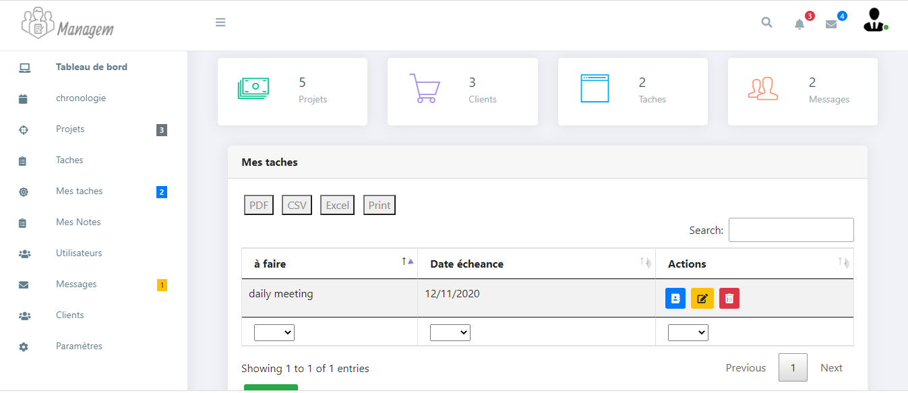

## Introduction

Managem is the World’s most advanced project management system which helps you to run your business efficiently and effectively, providing all of the tools that you need to communicate with your clients and your team.

## Informations
-   Status: under development
-   Version: 1.0
-   Sector: industry
-   Created: November 2020
-   Last updated: December 2020

## Table of contents
* [Documentation](#general-info)
* [Demo](#demo)
* [Screenshots](#screenshots)
* [Technologies](#technologies)
* [Setup](#setup)
* [Features](#features)
* [Status](#status)
* [Contact](#contact)
* [License](#license)

## Documentation
https://github.com/aniskchaou/MANAGEM-FRONTEND-ADMIN/wiki

## Demo
https://humant.herokuapp.com/

## Screenshots

## Technologies
* Spring boot
* React.js

## Setup

## Features
 -  Manage projects
-   Manage tasks
-   Manage users
-   Manage notes
-   Manage clients

  

## Contact
contact@delta-dev-software.com

## License
<a href="license.txt">MIT License</a>